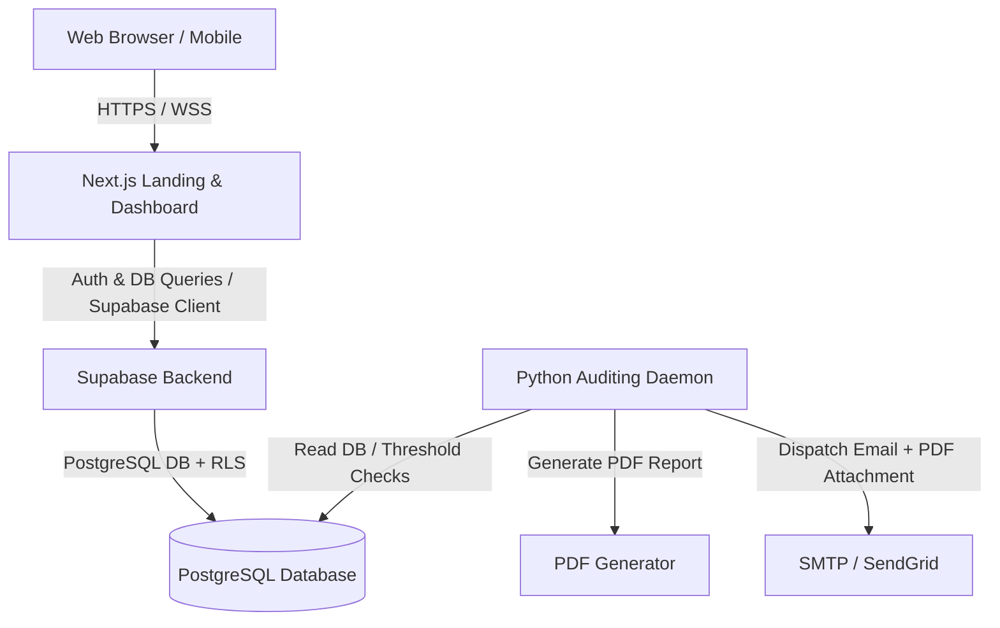

# Architecture & Design Specifications

This document outlines the software architecture, technology stack, directory structure, and cybersecurity guidelines for the willyfastsolutions B2B Multi-tenant fleet management SaaS platform.

## 1. System Overview

willyfastsolutions is a Multi-tenant SaaS platform built to help companies track heavy machinery (Forklifts, Excavators, Skid Steer Loaders), record operating hours, manage preventive maintenance checklists, and receive automated alerts and reports when machinery hours exceed safety thresholds.



## 2. Technology Stack

### Frontend (Landing Page & SaaS Dashboard)
- **Framework**: Next.js 14+ (App Router, React Server Components)
- **Styling**: Tailwind CSS + Shadcn UI (Radix UI primitives)
- **Design Aesthetic**: Minimalist, soft/monochromatic color palette (Slate, Zinc, Muted colors) for optimal readability and reduced eye strain during long operational shifts. Mobile-First responsive layouts.
- **Client Auth & DB**: Supabase JS SDK.

### Backend & Database
- **Database**: Supabase PostgreSQL.
- **Security**: Strict **Row Level Security (RLS)** policies to ensure data isolation between tenants (companies). No tenant can read or write another tenant's data.

### Automated Auditing Agent (Daemon) & Backend API
- **Language**: Python 3.10+
- **API Framework (if needed)**: FastAPI (adhering to FastAPI best practices)
- **Daemon Worker**: Standalone Python script running in background/cron checking machinery hours.
- **PDF Generation**: WeasyPrint or ReportLab for pixel-perfect executive reports with KPIs.
- **Email Delivery**: SMTPLib or SendGrid API integration.

## 3. B2B Multi-Tenant Data Isolation (OWASP API Security)

To prevent Broken Object Level Authorization (BOLA) and IDOR attacks, we enforce strict multi-tenant separation using PostgreSQL Row Level Security (RLS).

- **Tenant Definition**: Each user belongs to a `tenant` (Company).
- **Session Context**: The application uses Supabase Auth to retrieve the user's JWT.
- **RLS Policies**:
  - `companies` table: Users can only select/update their own company profile.
  - `machinery` table: Users can only access machinery where `company_id = auth.jwt() ->> 'company_id'` (or through a joint helper mapping users to companies).
  - `hour_logs` and `maintenance_logs`: Access is restricted to logs associated with machinery owned by the user's company.

## 4. Directory Structure

The repository is structured to isolate the Next.js frontend, the Python backend daemon, and database migration scripts.

```
willyfastsolutions/
├── .agents/                    # Local Agent skills
│   └── skills/
│       ├── neon-postgres/
│       └── seo-audit/
├── docs/                       # Project documentation & design files
├── database/                   # Database schemas and migration scripts
│   └── database_schema.sql
├── frontend/                   # Next.js App (Landing Page & SaaS Dashboard)
│   ├── app/                    # Next.js App Router
│   │   ├── page.tsx            # Public Landing Page (Home, Features, etc.)
│   │   ├── login/              # Login Page
│   │   ├── dashboard/          # Auth-protected B2B SaaS Dashboard
│   │   │   ├── page.tsx        # Dashboard Main View
│   │   │   ├── machinery/      # Fleet / Machinery Management
│   │   │   └── maintenance/    # Preventive Maintenance & Checklists
│   │   └── layout.tsx
│   ├── components/             # Reusable UI Components (Shadcn UI)
│   │   ├── ui/                 # Atomic Shadcn components (button, dialog, input, etc.)
│   │   └── custom/             # Custom dashboard layout/nav elements
│   ├── styles/
│   │   └── globals.css         # Tailwind & Theme configuration
│   ├── package.json
│   ├── tailwind.config.js
│   └── tsconfig.json
├── backend/                    # Python Backend, API & Daemon Worker
│   ├── requirements.txt
│   ├── app/                    # FastAPI Microservices (if any)
│   │   ├── __init__.py
│   │   └── main.py
│   ├── daemon/                 # 24/7 background worker
│   │   ├── __init__.py
│   │   ├── config.py
│   │   ├── db.py               # Supabase/PostgreSQL connection helper
│   │   ├── worker.py           # Core auditing script (scans database)
│   │   ├── pdf_generator.py    # PDF document builder
│   │   └── email_sender.py     # SMTPLib / SendGrid integrations
│   └── tests/                  # Backend unit/integration tests
├── .gitignore
├── architecture.md             # This file
└── project_status.md           # Project state and roadmap
```

## 5. Coding Standards & Conventions

- **Code Comments**: English and Spanish mixed where helpful (Spanish for logic commentary, English for API/docstrings/names).
- **UI Language**: Strict **English** (US Market focus).
- **REST Endpoints**: Snake case for JSON keys, proper HTTP status codes.
- **Git Flow**:
  - `main`: Production-ready code.
  - `develop`: Pre-production testing code.
  - `feature/*`: Development branches.
